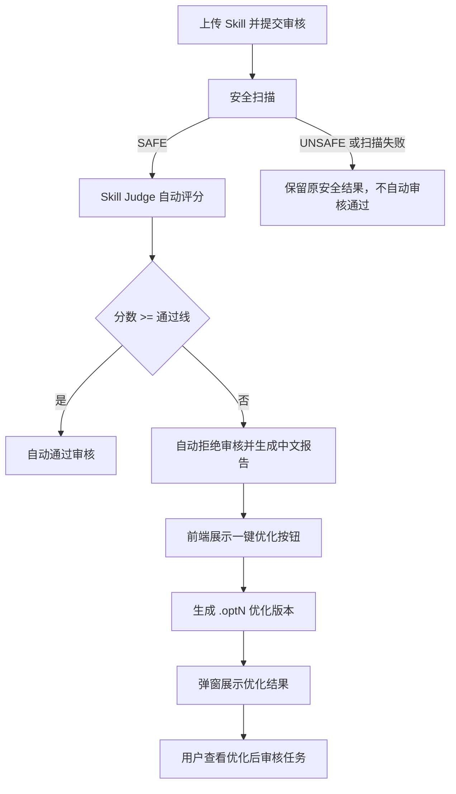

# Skill Judge 自动审核与一键优化变更说明

本文档说明 `codex/auto-review-skill-judge` 分支相对 `main` 分支新增的 Skill Judge 自动审核、一键优化、优化结果弹窗和部署配置能力。

## 对比范围

- 对比基准：`main`
- 当前分支：`codex/auto-review-skill-judge`
- 变更提交：
  - `76caaecc feat: add skill judge auto review`
  - `19658ab8 feat: render skill judge auto review report`
  - `d7da40e5 fix: backfill pending auto reviews`
  - `9a17537a fix: delete review tasks when replacing versions`
  - `67816d3a feat: add skill judge one-click optimization`
  - `84042eb6 feat: preserve Chinese skill semantics during optimization`
  - `491318c6 feat: show skill optimization summary dialog`

## 功能总览

本分支把原本需要人工处理的 Skill 审核流程扩展为：

1. 技能上传并提交审核。
2. 安全扫描完成后，如果结果安全，自动进入 Skill Judge 评分。
3. 系统根据分数自动通过或自动拒绝。
4. 自动审核结果以中文报告形式展示在前端审核详情页。
5. 对于 Skill Judge 自动拒绝的审核任务，前端提供“一键优化”按钮。
6. 一键优化会生成新的优化版本并重新提交扫描和审核。
7. 优化成功后，前端弹窗展示本次新增内容、保留内容、优化依据、报告问题与补强对应关系。



## 自动审核能力

### 配置开关

新增 `AutoReviewProperties`，通过环境变量控制自动审核行为：

```bash
SKILLHUB_AUTO_REVIEW_ENABLED=true
SKILLHUB_AUTO_REVIEW_PASS_SCORE=96
SKILLHUB_AUTO_REVIEW_REVIEWER_ID=system-auto-review
SKILLHUB_AUTO_REVIEW_COMPENSATION_INITIAL_DELAY_MS=15000
SKILLHUB_AUTO_REVIEW_COMPENSATION_DELAY_MS=60000
```

默认行为：

- `enabled=false`，默认不自动审核，避免部署后误自动决策。
- `pass-score=96`，满分 120，默认通过线为 B 档。
- `reviewer-id=system-auto-review`，用于记录自动审核操作人。

涉及文件：

- `server/skillhub-app/src/main/java/com/iflytek/skillhub/config/AutoReviewProperties.java`
- `server/skillhub-app/src/main/resources/application.yml`
- `.env.release.example`
- `compose.release.yml`

### 触发时机

新增两类自动审核入口：

- 安全扫描完成后：`SecurityScanCompletedEvent` 发布后，监听器在事务提交后触发自动审核。
- 审核提交后：如果安全扫描关闭，版本直接进入 `PENDING_REVIEW`，监听器会尝试自动审核。

为了防止重启、事件丢失或扫描服务延迟导致任务一直停留在“待审核”，新增补偿任务：

- 定时扫描 `PENDING` 审核任务。
- 只处理版本状态为 `PENDING_REVIEW` 的任务。
- 默认启动 15 秒后首次执行，之后每 60 秒执行一次。

涉及文件：

- `server/skillhub-domain/src/main/java/com/iflytek/skillhub/domain/event/SecurityScanCompletedEvent.java`
- `server/skillhub-app/src/main/java/com/iflytek/skillhub/service/autoreview/AutoReviewEventListener.java`
- `server/skillhub-app/src/main/java/com/iflytek/skillhub/task/AutoReviewCompensationTask.java`

### 自动审核流程

核心服务为 `AutoReviewAppService`。

执行逻辑：

1. 判断自动审核是否开启。
2. 判断版本是否处于 `PENDING_REVIEW`。
3. 找到该版本对应的 `PENDING` 审核任务。
4. 从对象存储读取已上传的 bundle。
5. 使用 Skill Judge 规则评分。
6. 分数达到通过线时调用原有 `ReviewService.approveReview`。
7. 分数低于通过线时调用原有 `ReviewService.rejectReview`。
8. 读取包或评分异常时只记录 warning，不自动通过或拒绝，保留人工审核兜底。

涉及文件：

- `server/skillhub-app/src/main/java/com/iflytek/skillhub/service/autoreview/AutoReviewAppService.java`
- `server/skillhub-app/src/main/java/com/iflytek/skillhub/service/autoreview/ObjectStorageSkillPackageReader.java`
- `server/skillhub-app/src/main/java/com/iflytek/skillhub/service/autoreview/StoredSkillPackageReader.java`
- `server/skillhub-app/src/main/java/com/iflytek/skillhub/service/autoreview/SkillPackageSnapshot.java`
- `server/skillhub-app/src/main/java/com/iflytek/skillhub/service/autoreview/SkillPackageBundle.java`
- `server/skillhub-app/src/main/java/com/iflytek/skillhub/service/autoreview/SkillPackageFile.java`

## Skill Judge 评分规则

新增 `HeuristicSkillJudgeEvaluator`，满分 120 分。评分结果包含：

- `score`：最终分数。
- `maxScore`：满分。
- `grade`：A/B/C/D/F。
- `summary`：问题摘要。
- `issues`：逐项问题列表。

主要扣分维度：

| 维度 | 检查内容 |
| --- | --- |
| 格式规范 | `name` 是否符合小写字母、数字、连字符规则；`description` 是否为空 |
| 触发描述 | `description` 是否包含明确触发场景，支持英文和中文触发语义 |
| 知识增量 | 正文是否过短，是否包含专家判断、criteria、rubric、evidence 等依据 |
| 风险边界 | 是否包含 Never Do、Avoid、Red Flags、anti-pattern 等风险提示 |
| 渐进披露 | 是否存在 `references/`，以及是否说明何时读取引用资料 |
| 可执行性 | 是否包含 workflow、checklist、步骤、输出模板等可执行结构 |

中文触发描述已被纳入识别，例如：

- `触发`
- `触发场景`
- `当用户`
- `用于`
- `适用`
- `审核`
- `评估`
- `优化`
- `改进`

涉及文件：

- `server/skillhub-app/src/main/java/com/iflytek/skillhub/service/autoreview/HeuristicSkillJudgeEvaluator.java`
- `server/skillhub-app/src/main/java/com/iflytek/skillhub/service/autoreview/SkillJudgeEvaluator.java`
- `server/skillhub-app/src/main/java/com/iflytek/skillhub/service/autoreview/SkillJudgeEvaluationResult.java`
- `server/skillhub-app/src/main/java/com/iflytek/skillhub/service/autoreview/SkillJudgeIssue.java`

## 自动审核中文报告

自动审核通过或拒绝后，会把审核意见写入 `review_comment`，前端在审核详情页渲染为 Markdown。

报告结构：

````markdown
# Skill Judge 自动审核报告

结论：自动通过 / 自动拒绝
分数：84/120（等级 C，通过线 96）
拒绝原因：...

## 逐项问题
1. 【触发描述｜中｜扣 12 分】description 缺少明确触发场景，自动激活会不稳定。

## 具体修改建议
1. 补充什么任务会触发该 Skill，并点出输入对象和目标结果。

## 示例改写
1. 建议写法：
   ```markdown
   description: 当用户需要审核、评估或优化一个 Skill 包时使用，输出评分、问题清单和修改建议。
   ```
````

前端新增 `ReviewCommentReport`，将原始报告以更可读的 Markdown 样式展示。

涉及文件：

- `server/skillhub-app/src/main/java/com/iflytek/skillhub/service/autoreview/AutoReviewAppService.java`
- `web/src/features/review/review-comment-report.tsx`
- `web/src/pages/dashboard/review-detail.tsx`

## 一键优化能力

### 后端接口

新增审核优化接口：

```http
POST /api/web/reviews/{id}/optimize
POST /api/v1/reviews/{id}/optimize
```

只有满足以下条件才允许优化：

- 审核任务存在。
- 当前用户有权限查看该审核任务。
- 审核任务状态为 `REJECTED`。
- `review_comment` 中包含 `Skill Judge 自动审核报告`。

涉及文件：

- `server/skillhub-app/src/main/java/com/iflytek/skillhub/controller/portal/ReviewController.java`
- `server/skillhub-app/src/main/java/com/iflytek/skillhub/service/GovernanceWorkflowAppService.java`
- `server/skillhub-app/src/main/java/com/iflytek/skillhub/service/autoreview/SkillJudgeOptimizationAppService.java`
- `server/skillhub-app/src/main/java/com/iflytek/skillhub/dto/ReviewOptimizationResponse.java`

### 版本生成逻辑

一键优化不会覆盖原版本，而是创建新版本：

- 新版本号为：`原版本.opt1`、`原版本.opt2`，依次递增。
- 最多尝试到 `.opt20`。
- 优化后重新调用发布流程 `publishFromEntries`，重新生成审核任务。
- 原有 bundle 中的非 `SKILL.md` 文件会保留。

### 优化内容生成逻辑

优化器为 `SkillJudgePackageOptimizer`。

关键原则：

- 保留原中文 `description`。
- 保留原有正文内容。
- 保留原有 `scripts/`、`references/` 等附属文件。
- 不把原 Skill 替换成英文模板。
- 只追加缺失章节。
- 根据审核报告逐项补强。
- 不覆盖原业务语义。

优先追加的章节：

- `## 触发条件`
- `## 使用前置条件`
- `## 执行步骤`
- `## 错误处理`
- `## 输出格式`
- `## 风险提示`

优化后的 `SKILL.md` 末尾会追加：

```markdown
## Skill Judge 优化说明

### 本次新增
- 触发条件
- 执行步骤

### 已保留
- 原始 description
- 原有正文内容
- 原有 scripts/、references/ 等附属文件

### 优化依据
- 分数：84/120...
- 本次优化只补充缺失说明，不覆盖原业务语义。

### 报告问题与补强对应
- 报告问题：description 缺少明确触发场景...
  建议来源：补充什么任务会触发该 Skill...
  对应补强：触发条件
```

涉及文件：

- `server/skillhub-app/src/main/java/com/iflytek/skillhub/service/autoreview/SkillJudgePackageOptimizer.java`
- `server/skillhub-app/src/main/java/com/iflytek/skillhub/service/autoreview/SkillJudgeOptimizationResult.java`
- `server/skillhub-app/src/main/java/com/iflytek/skillhub/service/autoreview/SkillJudgeOptimizationSummary.java`

## 优化结果弹窗

前端在 Skill Judge 自动拒绝的审核详情页显示“一键优化”按钮。

点击成功后：

1. 不立即跳转。
2. 先弹出 `Skill Judge 优化结果` 弹窗。
3. 弹窗展示：
   - 优化后版本号。
   - 本次新增。
   - 已保留。
   - 优化依据。
   - 报告问题与补强对应。
4. 用户点击 `查看优化后审核任务` 后，再跳转到新生成的审核任务页面。

接口响应新增结构化字段：

```json
{
  "skillId": 30,
  "namespace": "global",
  "slug": "demo-skill",
  "skillVersionId": 11,
  "reviewTaskId": 100,
  "version": "20260610.062442.opt1",
  "status": "PENDING_REVIEW",
  "optimizationSummary": {
    "addedSections": ["触发条件", "执行步骤"],
    "preservedItems": ["原始 description", "原有正文内容"],
    "reportSummary": "分数：84/120",
    "reportMappings": [
      {
        "problem": "description 缺少明确触发场景",
        "suggestion": "补充什么任务会触发该 Skill",
        "matchedSections": ["触发条件"]
      }
    ]
  }
}
```

涉及文件：

- `web/src/pages/dashboard/review-detail.tsx`
- `web/src/features/review/use-review-detail.ts`
- `web/src/api/client.ts`
- `web/src/api/types.ts`
- `web/src/api/generated/schema.d.ts`
- `web/src/i18n/locales/zh.json`
- `web/src/i18n/locales/en.json`

## 安全扫描联动

本分支把自动审核放在安全扫描之后，避免未通过安全扫描的包被自动审核通过。

关键点：

- `SecurityScanCompletedEvent` 在扫描结果持久化且版本状态离开 `SCANNING` 后发布。
- 自动审核只在 `event.safe() == true` 时继续。
- 前端审核详情页在版本状态为 `SCANNING` 时禁用人工通过按钮，提示等待安全扫描完成。
- `compose.release.yml` 新增 `skill-scanner` 服务，并在后端容器中配置扫描服务地址。

涉及文件：

- `server/skillhub-domain/src/main/java/com/iflytek/skillhub/domain/security/SecurityScanService.java`
- `server/skillhub-domain/src/main/java/com/iflytek/skillhub/domain/event/SecurityScanCompletedEvent.java`
- `web/src/pages/dashboard/review-detail.tsx`
- `compose.release.yml`

## 部署相关改动

### Release Compose

`compose.release.yml` 新增：

- `skill-scanner` 服务。
- 后端自动审核环境变量透传。
- 后端安全扫描环境变量透传。
- 账号密码直登环境变量透传。

关键变量：

```bash
SKILLHUB_AUTO_REVIEW_ENABLED=true
SKILLHUB_AUTO_REVIEW_PASS_SCORE=96
SKILLHUB_AUTO_REVIEW_REVIEWER_ID=system-auto-review
SKILLHUB_SECURITY_SCANNER_ENABLED=true
SKILLHUB_SECURITY_SCANNER_URL=http://skill-scanner:8000
SKILLHUB_SECURITY_SCANNER_MODE=upload
SKILLHUB_AUTH_DIRECT_ENABLED=true
SKILLHUB_WEB_AUTH_DIRECT_ENABLED=true
SKILLHUB_WEB_AUTH_DIRECT_PROVIDER=local
```

### 远端构建部署命令

由于本分支同时修改了后端和前端，远端部署需要同时重建 `server` 和 `web` 镜像：

```bash
cd ~/skillhub_my/skillhub
git checkout codex/auto-review-skill-judge
git pull --ff-only origin codex/auto-review-skill-judge

docker build --pull -t skillhub-server:auto-review ./server
docker build --pull -t skillhub-web:auto-review ./web

docker compose --env-file .env -f compose.release.yml -f compose.local.yml up -d --no-deps --force-recreate server web
```

如果只改后端逻辑，可以只重建 `server`；但从 `491318c6` 开始包含弹窗前端改动，所以必须重建 `web`。

## 测试覆盖

新增和更新的测试覆盖：

- 自动审核配置绑定。
- Skill Judge 评分器。
- 自动通过和自动拒绝流程。
- 安全扫描完成后自动审核。
- pending 审核补偿。
- 一键优化生成新版本。
- 优化器保留中文 description。
- 优化器只追加缺失章节。
- 优化结果结构化返回。
- 前端审核报告 Markdown 展示。
- 前端一键优化按钮。
- 前端优化结果弹窗。

主要测试文件：

- `server/skillhub-app/src/test/java/com/iflytek/skillhub/config/AutoReviewPropertiesBindingTest.java`
- `server/skillhub-app/src/test/java/com/iflytek/skillhub/service/autoreview/AutoReviewAppServiceTest.java`
- `server/skillhub-app/src/test/java/com/iflytek/skillhub/service/autoreview/HeuristicSkillJudgeEvaluatorTest.java`
- `server/skillhub-app/src/test/java/com/iflytek/skillhub/service/autoreview/SkillJudgeOptimizationAppServiceTest.java`
- `server/skillhub-app/src/test/java/com/iflytek/skillhub/service/autoreview/SkillJudgePackageOptimizerTest.java`
- `server/skillhub-app/src/test/java/com/iflytek/skillhub/controller/ReviewPortalControllerTest.java`
- `web/src/features/review/review-comment-report.test.tsx`
- `web/src/pages/dashboard/review-detail.test.tsx`

本地已验证命令：

```bash
JAVA_HOME=/opt/homebrew/opt/openjdk@21/libexec/openjdk.jdk/Contents/Home \
PATH=/opt/homebrew/opt/openjdk@21/bin:$PATH \
./mvnw -pl skillhub-app,skillhub-domain -am \
  -Dtest=SkillJudgePackageOptimizerTest,SkillJudgeOptimizationAppServiceTest,AutoReviewAppServiceTest,HeuristicSkillJudgeEvaluatorTest,ReviewPortalControllerTest \
  -Dsurefire.failIfNoSpecifiedTests=false test
```

```bash
cd web
./node_modules/.bin/vitest run src/pages/dashboard/review-detail.test.tsx
./node_modules/.bin/tsc -b
```

## 与 main 分支相比的文件级影响

新增或重点修改模块：

- 自动审核配置：`AutoReviewProperties`、`application.yml`、`.env.release.example`。
- 自动审核服务：`AutoReviewAppService`、`AutoReviewEventListener`、`AutoReviewCompensationTask`。
- Skill Judge 评分：`HeuristicSkillJudgeEvaluator`、`SkillJudgeEvaluationResult`、`SkillJudgeIssue`。
- 存储读取：`ObjectStorageSkillPackageReader`、`SkillPackageBundle`、`SkillPackageFile`。
- 一键优化：`SkillJudgeOptimizationAppService`、`SkillJudgePackageOptimizer`、`SkillJudgeOptimizationSummary`。
- 审核接口：`ReviewController`、`ReviewOptimizationResponse`、`GovernanceWorkflowAppService`。
- 前端审核详情页：`review-detail.tsx`、`use-review-detail.ts`、`review-comment-report.tsx`。
- 前端接口类型：`web/src/api/types.ts`、`web/src/api/generated/schema.d.ts`。
- 部署：`compose.release.yml`、`docs/20-auto-review-deployment.md`。

## 当前限制和注意事项

- 当前 Skill Judge 是启发式规则评分，不调用外部大模型。
- 自动审核失败时不会强行给结论，会回退到人工审核。
- 一键优化只修改 `SKILL.md`，不自动生成新的 `references/` 文件或脚本。
- 一键优化是保守追加策略，不会主动重写用户原有业务语义。
- 自动审核通过线建议先保持 96，等积累更多真实样本后再调整。
